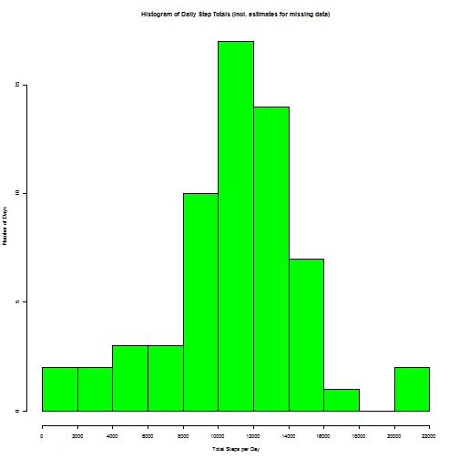

Reproducible Research Assignment 1
====================================

This assignment makes use of data from a personal activity monitoring device. This device collects data at 5 minute intervals through out the day. The data consists of two months of data from an anonymous individual collected during the months of October and November, 2012 and include the number of steps taken in 5 minute intervals each day.

The following report describes a number of aspects of that data

## Loading and preprocessing the data

```r
library(ggplot2)
library(lattice)
options(digits=1,scipen=999)
df <- read.csv("activity.csv")
df$day <- weekdays(as.Date(df$date))
```
The data has been loaded and a day-of-week field added


## What is mean total number of steps taken per day?

This histogram shows the distribution of daily totals for the number of steps taken. It should be read for instance, on *y* days in the period between, say, 8000 and 9999 steps were taken. Days with missing data have been omitted. 


```r
t <- tapply(df$steps,df$date,sum)
t <- as.data.frame(t)
names(t)[1] <- "steps"
par(cex=0.5)
hist(t$steps,breaks=seq(0,22000,l=12),col="lightblue",main="Histogram of Daily Step Totals",xlab="Total Steps per Day",ylab="Number of Days",xaxt="n")
axis(side=1,at=seq(0,22000,2000))
```

 

```r
mean_steps <- mean(t$steps,na.rm=T)
median_steps <- median(t$steps,na.rm=T)
```

The mean total number of steps taken per day was 10766.2 and the median daily total was 10765


## What is the average daily activity pattern?

The chart beneath shows how activity fluctuates during the day. The average number of steps in each 5-minute interval across all the days in the data (again omitting missing data) is plotted.


```r
a <- aggregate(steps~interval,df,mean)
peak_int <- a$interval[which.max(a$steps)]
par(cex=1)
with(a,plot(interval,steps,type="l",main="Average Steps Taken Throughout Day",xlab="5-minute interval from...",ylab="Avg Steps Taken in Interval"))
```

 

This shows the peak interval with the most activity was the 5 minutes from 835.

## Imputing missing values


```r
no_miss_vals <- sum(is.na(df))
```

In total, 2304 intervals have missing data.

Because of the potential bias introduced into calculations and summaries by this missing data, a method of estimating their values has been devised.
Essentially, where an interval has missing data, the mean of that interval across all the days with data is used. However to account for some possible regular variation in the days of the week, this interval mean is then up- or down-weighted using a day-of-week index.


```r
t$day <- weekdays(as.Date(rownames(t),"%Y-%m-%d"))
a1 <- aggregate(steps~day,t,mean)
a1$wkdidx <- 7*a1$steps/sum(a1$steps)
names(df)[1] <- "steps.orig"
df <- merge(df,a,by="interval",all.x=T)
names(df)[5] <- "steps.avg.int"
df <- merge(df,a1,by="day",all.x=T)
names(df)[6] <- "steps.total.wkd"
df$steps.est <- ifelse(is.na(df$steps.orig),round(df$steps.avg.int*df$wkdidx,digits=0),df$steps.orig)
```

The code chunk above has applied the imputation algorithm with the result that the original dataset, read into *df*, has some extra columns. The last of these *steps.est* is the new value for the amount of steps in the interval. The value is either the same as the original one or if it was missing, it is the rounded value of the estimate.

The earlier histogram is then re-plotted beneath including the estimated data.


```r
t2 <- tapply(df$steps.est,df$date,sum)
mean_steps_rev <- mean(t2,na.rm=T)
median_steps_rev <- median(t2,na.rm=T)
par(cex=0.5)
hist(t2,breaks=seq(0,22000,l=12),col="green",main="Histogram of Daily Step Totals (incl. estimates for missing data)",xlab="Total Steps per Day",ylab="Number of Days",xaxt="n")
axis(side=1,at=seq(0,22000,2000))
```

 

There have been some revisions to the mean and median daily totals. The new mean is now 10806.4 (a change of 40.2) and the new median is 11015, revised by 250.

## Are there differences in activity patterns between weekdays and weekends?

A new factor variable is introduced into the dataset, identifying whether the day in question is a weekday (Mon-Fri) or a weekend day (Sat & Sun).


```r
df$wk <- ifelse(df$day=="Saturday"|df$day=="Sunday","Weekend","Weekday")
b <- aggregate(steps.est~interval+wk,df,mean)
b <- transform(b,wk=factor(wk))
```

Two different plots of intra-day activity can be made to contrast weekdays and weekends


```r
p <- xyplot(steps.est~interval|wk,b,layout=c(1,2),type="l",main="Weekend-Weekday Comparison",xlab="5-minute interval from...",ylab="Avg Steps Taken in Interval")
print(p)
```

 
